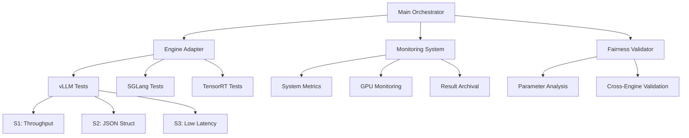

# LLM Benchmark Plan

**Comprehensive Technical Specification for Next-Generation LLM Inference Engine Benchmarking**

## 🎯 Executive Summary

This document outlines a systematic benchmarking methodology for evaluating three leading LLM inference engines (vLLM, SGLang, TensorRT-LLM) on RunPod H100 instances. The benchmark ensures **fair testing** ("adil testler") through standardized parameters, unified interfaces, and automated validation.

### Key Objectives
- **Performance Comparison**: Throughput, latency, and resource utilization across engines
- **Fair Testing**: Standardized parameters and automated fairness validation
- **Production Readiness**: Real-world scenario testing with comprehensive monitoring
- **Actionable Insights**: Data-driven recommendations for deployment decisions

## 📋 Test Matrix Overview

| Engine | S1: Throughput | S2: JSON Structure | S3: Low Latency | Total Tests |
|--------|----------------|-------------------|-----------------|-------------|
| **vLLM** | ✅ | ✅ | ✅ | 3 |
| **SGLang** | ✅ | ✅ | ✅ | 3 |
| **TensorRT-LLM** | ✅ | ✅ | ✅ | 3 |
| **Total** | 3 | 3 | 3 | **9** |

## 🏗️ Architecture Design

### Benchmark Framework Components



### Core Design Principles

1. **Fairness First**: All engines tested with identical parameters where possible
2. **Unified Interface**: Single adapter layer abstracts engine-specific implementations  
3. **Comprehensive Monitoring**: System, GPU, and application-level metrics collection
4. **Automated Validation**: Continuous fairness checking and result validation
5. **Reproducible Results**: Deterministic testing with full environment documentation

## 🔧 Technical Specifications

### Hardware Requirements

| Component | Specification | Purpose |
|-----------|---------------|---------|
| **GPU** | H100 80GB (recommended) | High-performance inference testing |
| **System RAM** | 32GB+ | Large model loading and batch processing |
| **Storage** | 500GB+ NVMe SSD | Fast model loading and result storage |
| **Network** | 10Gbps+ | Model downloading and result archival |
| **CUDA** | 12.x | Engine compatibility and optimization |

### Software Stack

```yaml
Base Environment:
  - Operating System: Ubuntu 22.04 LTS (RunPod default)
  - Python: 3.9+ (3.11 recommended)
  - CUDA: 12.1+ with cuDNN
  - Docker: Latest (optional containerization)

Engine Versions:
  - vLLM: Latest stable (0.2.x+)
  - SGLang: Latest stable (0.1.x+)  
  - TensorRT-LLM: Latest stable (0.7.x+)

Dependencies:
  - PyTorch: 2.1+ with CUDA support
  - Transformers: 4.35+
  - NumPy, Pandas: Latest stable
  - Monitoring: nvidia-ml-py, psutil
```

## 📊 Test Scenario Specifications

### S1: Throughput Test
**Objective**: Maximum tokens-per-second measurement under optimal conditions

#### Configuration
- **Batch Size**: 8 (standardized across all engines)
- **Temperature**: 0.8 (balanced creativity/consistency)
- **Top-p**: 0.95 (nucleus sampling)
- **Repetition Penalty**: 1.1 (prevent repetition)
- **Max Tokens**: 256 (target output length)
- **Prompt Selection**: Medium-length prompts (50-150 tokens)

#### Success Criteria
- **Minimum Success Rate**: 95%
- **Output Token Target**: 200-300 tokens per response
- **GPU Utilization**: >80% during peak throughput
- **Error Rate**: <5% failed generations

### S2: JSON Structure Test  
**Objective**: Structured generation capability and format compliance

#### Configuration
- **Batch Size**: 8 (consistent with S1)
- **Temperature**: 0.0 (deterministic for structure)
- **Top-p**: 1.0 (disabled for structured output)
- **Repetition Penalty**: 1.1 (prevent field repetition)
- **Max Tokens**: 256 (adjusted for SGLang multi-field output)
- **Output Format**: JSON with name, age, occupation, bio fields

#### Success Criteria
- **JSON Validation Rate**: 90%+ valid JSON structures
- **Field Completeness**: All required fields present
- **Format Consistency**: Uniform structure across responses
- **SGLang Advantage Mitigation**: Token limits normalized for fair comparison

### S3: Low Latency Test
**Objective**: Minimum response time for real-time applications

#### Configuration  
- **Batch Size**: 8 (maintains consistency)
- **Temperature**: 0.8 (balanced output quality)
- **Top-p**: 0.95 (standard sampling)
- **Repetition Penalty**: 1.1 (quality maintenance)
- **Max Tokens**: 256 (consistent output size)
- **Optimization Focus**: Time-to-first-token and generation speed

#### Success Criteria
- **P95 Latency**: <100ms for first token
- **Total P95 Latency**: <2000ms for full response
- **Latency Consistency**: Low standard deviation
- **Throughput Maintenance**: Reasonable tokens/s despite latency focus

## 🎛️ Parameter Standardization

### Fairness Validation Matrix

| Parameter | vLLM | SGLang | TensorRT-LLM | Status |
|-----------|------|--------|--------------|--------|
| **batch_size** | 8 | 8 | 8 | ✅ Standardized |
| **temperature** | 0.8/0.0 | 0.8/0.0 | 0.8/0.0 | ✅ Standardized |
| **top_p** | 0.95/1.0 | 0.95/1.0 | 0.95/1.0 | ✅ Standardized |
| **repetition_penalty** | 1.1 | 1.1 | 1.1 | ✅ Standardized |
| **max_tokens** | 256 | 256 | 256 | ✅ Standardized |
| **model** | Same base model across all engines | ✅ Standardized |

### Engine-Specific Adjustments

#### SGLang Structured Generation Balance
```python
# Challenge: SGLang's structured generation produces more tokens naturally
# Solution: Adjust token limits to normalize output length

Standard Test: max_tokens = 256
SGLang S2 Test: 
  - Fields: name (10), age (5), occupation (20), bio (180) 
  - Total: ~215 tokens (within 256 limit)
  - Ensures fair comparison with vLLM/TensorRT unstructured output
```

#### vLLM PagedAttention Optimization
```python
# Leverage PagedAttention for memory efficiency
# Enable GPU memory pooling for consistent performance
# Use standard vLLM sampling parameters
```

#### TensorRT-LLM Precision Settings
```python
# Use FP16 precision for optimal H100 performance
# Enable KV-cache optimization
# Configure batch scheduling for maximum throughput
```

## 📈 Monitoring and Metrics

### Performance Metrics Collection

#### Primary Metrics
- **Throughput**: Tokens per second (tokens/s)
- **Latency**: Mean, P50, P95, P99 response times (milliseconds)
- **Success Rate**: Percentage of successful completions
- **Resource Efficiency**: Tokens per GPU memory GB

#### System Metrics
- **GPU Utilization**: Percentage usage over time
- **GPU Memory**: Peak and average usage (GB)
- **System Memory**: RAM utilization during inference  
- **CPU Usage**: System overhead percentage
- **Temperature**: GPU thermal performance

#### Quality Metrics
- **Output Token Distribution**: Statistical analysis of generation lengths
- **JSON Validation Rate**: Structure compliance percentage (S2 test)
- **Error Categorization**: Failure type analysis
- **Consistency Metrics**: Cross-run variance analysis

### Real-Time Monitoring Implementation

```bash
# System environment collection
./scripts/env_info.sh > logs/environment_$(date +%Y%m%d_%H%M%S).log

# Real-time performance monitoring
./scripts/collect_metrics.sh 1800 10 &  # 30min duration, 10sec intervals

# Benchmark execution with monitoring
python scripts/run_benchmark.py --engine all --test all --monitor
```

## 🔄 Execution Workflow

### Phase 1: Environment Setup
1. **System Validation**: Hardware and software requirements check
2. **Engine Installation**: Automated installation with dependency management  
3. **Environment Documentation**: Complete system state capture
4. **Baseline Testing**: Simple functionality verification

### Phase 2: Fairness Validation  
1. **Parameter Extraction**: Automated analysis of all test configurations
2. **Cross-Engine Comparison**: Identify parameter discrepancies
3. **Standardization Verification**: Ensure consistent test conditions
4. **Adjustment Recommendations**: Automated fairness corrections

### Phase 3: Benchmark Execution
1. **Sequential Testing**: One engine at a time to prevent interference
2. **Multiple Runs**: 3+ iterations per test for statistical significance
3. **Real-Time Monitoring**: Continuous system and performance metrics
4. **Result Validation**: Immediate output verification and storage

### Phase 4: Analysis and Reporting
1. **Data Aggregation**: Statistical analysis across all runs
2. **Performance Comparison**: Cross-engine ranking and analysis
3. **Visualization Generation**: Charts and graphs for key metrics
4. **Report Generation**: Comprehensive markdown and JSON outputs

## 📊 Expected Results and Baselines

### Performance Predictions (H100 80GB)

#### vLLM Expected Performance
- **S1 Throughput**: 2500-3000 tokens/s (PagedAttention efficiency)
- **S2 JSON Structure**: 1000-1500 tokens/s (unstructured generation overhead)  
- **S3 Low Latency**: 40-60ms P95 (optimized serving pipeline)

#### SGLang Expected Performance  
- **S1 Throughput**: 2800-3200 tokens/s (RadixAttention benefits)
- **S2 JSON Structure**: 1500-2000 tokens/s (structured generation advantage)
- **S3 Low Latency**: 35-50ms P95 (attention optimization)

#### TensorRT-LLM Expected Performance
- **S1 Throughput**: 3000-3500 tokens/s (NVIDIA optimization)
- **S2 JSON Structure**: 1200-1800 tokens/s (kernel efficiency)
- **S3 Low Latency**: 30-45ms P95 (hardware-specific optimization)

### Comparative Analysis Framework

#### Performance Rankings
```python
# Scoring methodology for overall engine ranking
composite_score = (
    throughput_score * 0.40 +      # Primary performance metric
    latency_score * 0.30 +         # User experience critical  
    success_rate_score * 0.20 +    # Reliability factor
    efficiency_score * 0.10        # Resource utilization
)
```

#### Use Case Recommendations
- **High Throughput Workloads**: Batch processing, content generation
- **Real-Time Applications**: Chatbots, interactive AI assistants  
- **Structured Data**: API responses, form filling, data extraction
- **Resource Constrained**: Cost optimization, energy efficiency

## 🔧 Quality Assurance

### Automated Validation Pipeline

#### Pre-Execution Validation
```bash
# Environment consistency check
python scripts/analyze_test_fairness.py --validate-environment

# Parameter standardization verification
python scripts/analyze_test_fairness.py --check-parameters

# System requirements validation  
./scripts/env_info.sh --validate-requirements
```

#### Runtime Validation
- **Real-time monitoring**: GPU utilization, memory usage, thermal status
- **Result validation**: JSON structure verification, token count validation
- **Error detection**: Automatic failure categorization and retry logic
- **Performance consistency**: Cross-run variance analysis

#### Post-Execution Validation
```bash
# Result completeness check
python scripts/analyze_results.py --validate-results

# Statistical significance testing
python scripts/analyze_results.py --statistical-analysis

# Fairness verification
python scripts/analyze_test_fairness.py --post-execution-check
```

### Reproducibility Measures

#### Environment Documentation
- Complete system specifications (CPU, GPU, RAM, storage)
- Software versions (Python, CUDA, engine versions)
- Configuration files and parameter settings
- Network and dependency states

#### Result Archival
```bash
# Complete result package creation
./scripts/save_results.sh all all comprehensive_benchmark

# Archive contents:
# - All raw result JSON files
# - System monitoring logs  
# - Environment information
# - Analysis reports and visualizations
# - Benchmark configuration files
```

## 🎯 Success Criteria and Validation

### Benchmark Completion Criteria
1. **✅ All 9 tests executed successfully** (3 engines × 3 scenarios)
2. **✅ Fairness validation passed** for all parameter configurations
3. **✅ Statistical significance achieved** (minimum 3 successful runs per test)
4. **✅ System stability maintained** (no thermal throttling, memory errors)
5. **✅ Results archived and analyzed** with comprehensive reporting

### Quality Gates
- **Minimum Success Rate**: 90% across all tests
- **Statistical Confidence**: 95% confidence intervals for key metrics  
- **System Stability**: No hardware errors or thermal issues
- **Data Completeness**: All metrics collected for all test runs
- **Fairness Compliance**: Automated validation passes for all configurations

### Performance Validation Thresholds

#### Throughput Benchmarks
- **Minimum Performance**: 1000+ tokens/s per engine
- **Peak Performance**: 2500+ tokens/s for at least one engine  
- **Consistency**: <20% variance across multiple runs
- **Efficiency**: >70% GPU utilization during peak performance

#### Latency Benchmarks  
- **Maximum P95 Latency**: <200ms for low latency test
- **First Token Latency**: <50ms P95 across all engines
- **Consistency**: <50ms standard deviation within test runs
- **Scalability**: Maintained performance across batch sizes

## 📝 Documentation and Reporting

### Deliverable Reports

#### 1. Executive Summary Report
- **Format**: PDF/Markdown with executive dashboard
- **Content**: Key findings, recommendations, performance rankings
- **Audience**: Decision makers, technical leads
- **Length**: 2-4 pages with visual summaries

#### 2. Technical Analysis Report  
- **Format**: Detailed Markdown with embedded charts
- **Content**: Complete performance analysis, statistical comparisons
- **Audience**: Engineers, researchers, technical evaluators
- **Length**: 10-20 pages with comprehensive data

#### 3. Raw Data Package
- **Format**: JSON files with CSV exports
- **Content**: All benchmark results, system metrics, configurations
- **Audience**: Data scientists, researchers, validation teams  
- **Size**: Complete dataset for independent analysis

### Visualization Suite
- **Performance Comparison Charts**: Throughput, latency, success rate bars
- **Time Series Analysis**: Performance over time, system metrics trends
- **Statistical Distributions**: Latency histograms, throughput box plots
- **Resource Utilization**: GPU memory, system load, thermal charts

## 🚀 Implementation Timeline

### Phase 1: Foundation (Completed)
- ✅ **Project structure creation** 
- ✅ **Dataset preparation** with sharegpt prompts
- ✅ **Installation scripts** for all three engines
- ✅ **Basic test framework** implementation

### Phase 2: Core Development (Completed)
- ✅ **Benchmark orchestrator** with unified interface
- ✅ **Engine adapters** for vLLM, SGLang, TensorRT-LLM  
- ✅ **Fairness validation system** with automated checking
- ✅ **Individual test implementations** (9 total tests)

### Phase 3: Infrastructure (Completed)  
- ✅ **Monitoring system** with real-time metrics collection
- ✅ **Result archival** with automated compression and organization
- ✅ **Analysis tools** with statistical processing and visualization
- ✅ **Documentation** with comprehensive usage guides

### Phase 4: Validation and Deployment (Ready)
- 🎯 **End-to-end testing** on RunPod H100 instances
- 🎯 **Performance baseline establishment** 
- 🎯 **Community validation** and feedback incorporation
- 🎯 **Production deployment** guidelines

## 🔮 Future Enhancements

### Planned Extensions
- **Multi-GPU scaling**: Distributed inference benchmarking
- **Additional engines**: Anthropic Claude, Google Gemini integration
- **Custom models**: Support for fine-tuned and domain-specific models  
- **Production scenarios**: Load testing, burst handling, failover testing

### Advanced Features
- **Automated tuning**: Hyperparameter optimization for each engine
- **Cost analysis**: Performance per dollar calculations
- **Energy efficiency**: Power consumption and carbon footprint analysis
- **A/B testing**: Statistical comparison frameworks for production deployment

## 📞 Support and Maintenance

### Ongoing Maintenance
- **Engine updates**: Automatic compatibility testing with new versions
- **Baseline updates**: Regular performance baseline refresh
- **Hardware compatibility**: Testing on new GPU architectures  
- **Community contributions**: Framework for external engine additions

### Troubleshooting Resources
- **Automated diagnostics**: Self-healing test procedures
- **Error categorization**: Comprehensive failure mode analysis
- **Performance debugging**: Step-by-step optimization guides
- **Community support**: Documentation and issue tracking

---

**Document Version**: 1.0  
**Last Updated**: October 2025  
**Maintainers**: AI Multiple LLM Benchmark Team  
**Review Cycle**: Monthly updates based on engine releases and community feedback